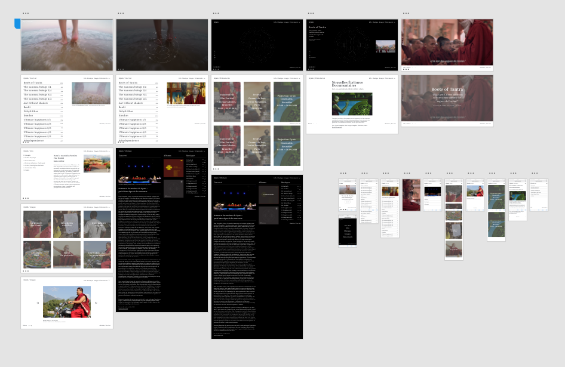

# Gyuto
### Web app for a film documentary by Filipa Cardoso.


> « To hear the sound of the ocean in the Himalayas… This unlikely wish takes a film director and her three curious girls to Gyuto, a Tibetan Buddhist monastery echoing day and night the sacred tantric chants of meditation, which the monks say, “sound like the waves of the ocean" » 

## Retro Planning

**Semaine du 29 - 02**
- **Pedro :** Footer / NavBar / bouttons / Page Play Video / Page Intro
- **Baptiste:** Intégration Page Images / Page Images Details
- **Liliane + Pedro:** Fichier JSON correct
- ~~**Geoffrey:** Screen Splash~~
- **Geoffrey:** 77 points mandala


**Semaine du 05 - 09**
- **Pedro:** Page Doc List / Page Home / Page Musique
- **Baptiste:** Intégration Page Events / Page Events Details / Page Info
- **Geoffrey:** Animations mandala
- **Pedro:** Symboles 
- **Liliane:** Ébauche de BD
(- Geoffrey: Iframe Mandala)

**Semaine du 12 - 16**
- **Liliane:** Relier / Tester BD API

**Semaine du 19 - 23**
- Début du déploiment
- Mandala fini.

**Semaine du 26 - 30**
- Mise en ligne
- Réglage de bugs

## Config
- NPM version 6.4
- PHP version 7.2
- LARAVEL 5.6
- SASS : ```node-sass style.scss style.css -w```

## Architecture


## Mockup

- [Desktop](https://xd.adobe.com/view/d3ba2b44-66c5-4626-4281-8233dd7db86c-a58b/?fullscreen)

## 77 points du mandala 


## Team
- Back-end [Liliane Mamane](https://github.com/lilama)
- Full Stack [Geoffrey Poelmans](https://github.com/geoffrey-poelmans)
- Front-end [Baptiste Firket](https://github.com/baptistefkt)
- UX/UI [Pedro Seromenho](http://pedroseromenho.com/)


## Back-end
```
{
  "admin": {
    "user": "",
    "email": "",
    "password": ""
  },
  "introduction": {
    "url": "",
    "legend": {
      "fr": "",
      "en": ""
    }
  },
  "videos": {
    "id": "",
    "title": {
      "fr": "",
      "en": ""
    },
    "category": "",
    "quote": {
      "fr": "",
      "en": ""
    },
    "legend": {
      "fr": "",
      "en": ""
    },
    "gif": "",
    "url": ""
  },
  "images": {
    "id": "",
    "title": {
      "fr": "",
      "en": ""
    },
    "galery": {
      "image": {
        "url": "",
        "title": {
          "fr": "",
          "en": ""
        },
        "legend": {
          "fr": "",
          "en": ""
        }
      }
    },
    "cover": ""
  },
  "music": {
    "video": {
      "url": "",
      "legend": {
        "fr": "",
        "en": ""
      }
    },
    "text": {
      "title": {
        "fr": "",
        "en": ""
      },
      "text": {
        "fr": "",
        "en": ""
      }
    },
    "album": {
      "id": "",
      "title": "",
      "url_order": "",
      "musics": {
        "url": "",
        "title": ""
      }
    }
  },
  "events": {
    "id": "",
    "title": "",
    "date": {
      "start": "",
      "end": ""
    },
    "hour": {
      "start": "",
      "end": ""
    },
    "adress": {
      "number": "",
      "street": "",
      "zipcode": "",
      "country": "",
      "city": ""
    },
    "description": {
      "fr": "",
      "en": ""
    },
    "image": ""
  },
  "info": {
    "id": "",
    "title": {
      "fr": "",
      "en": ""
    },
    "text": {
      "fr": "",
      "en": ""
    },
    "galery": {
      "image": {
        "url": "",
        "title": {
          "fr": "",
          "en": ""
        }
      }
    }
  }
}
````


## Technologies
- Laravel
- React JS
- SASS
- Adobe XD
- Git

## Typeface
- Begum, by [Indian type foundry](https://www.indiantypefoundry.com/fonts/begum)

##### With :heart: from us, at [becode]() oct-nov 2018.


