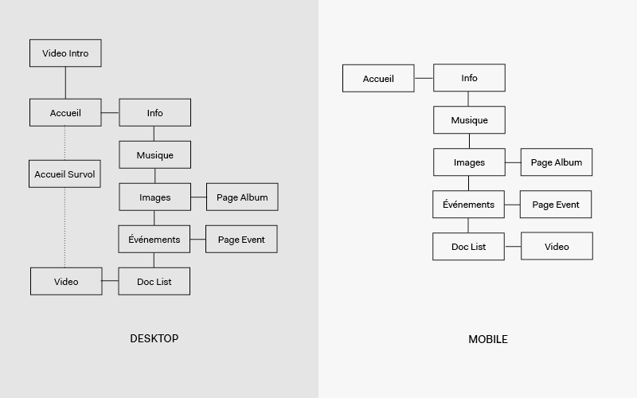
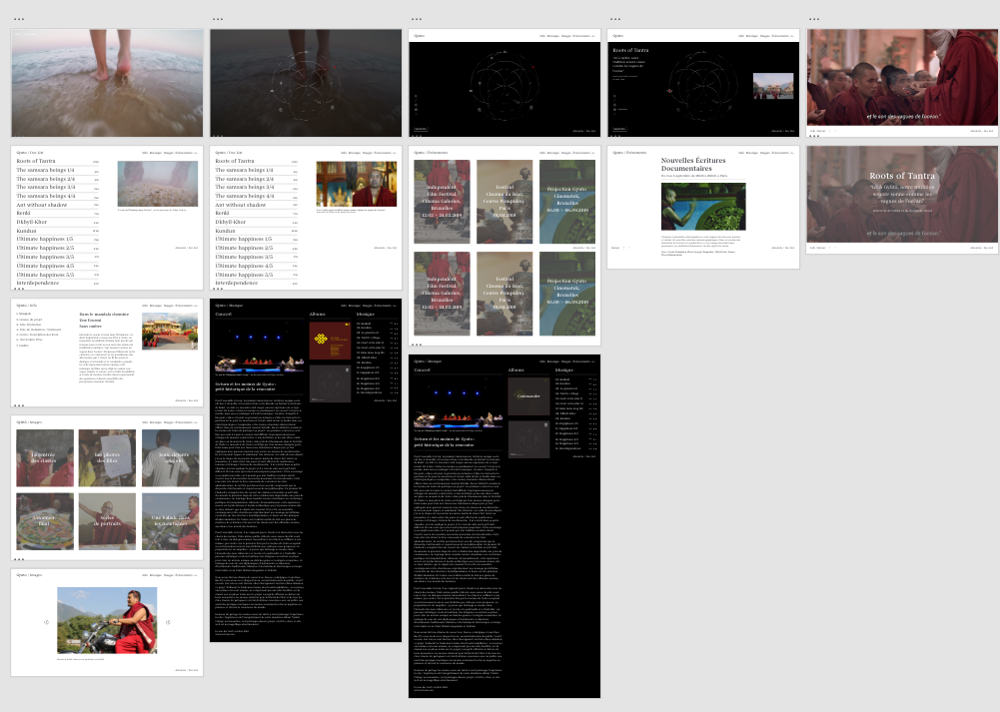

# Gyuto
### Web app for a film documentary by Filipa Cardoso.

> « To hear the sound of the ocean in the Himalayas… This unlikely wish takes a film director and her three curious girls to Gyuto, a Tibetan Buddhist monastery echoing day and night the sacred tantric chants of meditation, which the monks say, “sound like the waves of the ocean" » 

## Architecture

## Mockup

- [Desktop](https://xd.adobe.com/view/d3ba2b44-66c5-4626-4281-8233dd7db86c-a58b/?fullscreen)

## Team
- Back-end [Liliane Mamane](https://github.com/lilama)
- Full Stack [Geoffrey Poelmans](https://github.com/geoffrey-poelmans)
- Front-end [Baptiste Firket](https://github.com/baptistefkt)
- UX/UI [Pedro Seromenho](http://pedroseromenho.com/)

## Back-end
- **Admin Login:** 
    1. User 
    1. Pwd

- **Add Video:** 
    1. Title:
        - FR 
        - EN
    1. Type (select) 
    1. Citation:
        - FR 
        - EN
    1. Légende:
        - FR 
        - EN 
    1. URL video 
    1. Gif 
    1. Duration

- **Add Event:** 
    1. Title:
        - FR 
        - EN
    1. Date -> *Convert to text (FR / EN)* 
    1. Hour -> *Convert to text (FR / EN)* 
    1. Lieu 
    1. Description:
        - FR 
        - EN
    1. URL page event

- **Add Images:** 
    1. Galerie Name:
        - FR 
        - EN
    1. Date (select month + year) 
    1. Galerie Cover (img) 
    1. Galerie Images:
        - Image
        - FR 
        - EN

- **Add Music**: 
    1. Video (URL) 
    1. Title:
        - FR 
        - EN
    1. Description: 
        - Images
        - Texte: 
            - FR
            - EN
    1. Add Music(+): 
        - Title
        - Upload mp3 
    1. Add Album (+): 
     - Image 
     - URL (commander) 

- **Add Info**: *coming soon*

## Technologies
- Laravel
- React JS
- SASS
- Adobe XD
- Git

## Typeface
- Begum, by [Indian type foundry](https://www.indiantypefoundry.com/fonts/begum)

##### With :heart: from us, at [becode]() oct-nov 2018.

