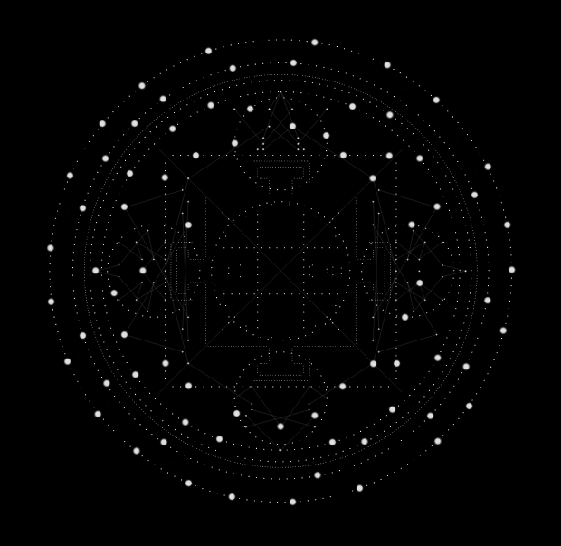

# Gyuto
### Web app for a film documentary by Filipa Cardoso.


> « To hear the sound of the ocean in the Himalayas… This unlikely wish takes a film director and her three curious girls to Gyuto, a Tibetan Buddhist monastery echoing day and night the sacred tantric chants of meditation, which the monks say, “sound like the waves of the ocean" » 

## Retro Planning

**Semaine du 29 - 02**
- **Pedro :** Footer / NavBar / bouttons / Page Play Video / Page Intro
- **Baptiste:** Intégration Page Images / Page Images Details
- **Liliane + Pedro:** Fichier JSON correct
- ~~**Geoffrey:** Screen Splash~~
- **Geoffrey:** 77 points mandala


**Semaine du 05 - 09**
- **Pedro:** Page Doc List / Page Home / Page Musique
- **Baptiste:** Intégration Page Events / Page Events Details / Page Info
- **Geoffrey:** Animations mandala
- **Pedro:** Symboles 
- **Liliane:** Ébauche de BD
(- Geoffrey: Iframe Mandala)

**Semaine du 12 - 16**
- **Liliane:** Relier / Tester BD API

**Semaine du 19 - 23**
- Début du déploiment
- Mandala fini.

**Semaine du 26 - 30**
- Mise en ligne
- Réglage de bugs

## Config
- NPM version 6.4
- PHP version 7.2
- LARAVEL 5.6
- SASS : ```node-sass style.scss style.css -w```

## Architecture


## Mockup

- [Desktop](https://xd.adobe.com/view/d3ba2b44-66c5-4626-4281-8233dd7db86c-a58b/?fullscreen)

## 77 points du mandala 




## Team
- Back-end [Liliane Mamane](https://github.com/lilama)
- Full Stack [Geoffrey Poelmans](https://github.com/geoffrey-poelmans)
- Front-end [Baptiste Firket](https://github.com/baptistefkt)
- UX/UI [Pedro Seromenho](http://pedroseromenho.com/)


## Back-end
```
export const login = [{
    user: "",
    password: ""
}],

export const videos = [
    {
        id: "",
        title: [{
            fr: "",
            en: "",
        }],
        type: "",
        quote: [{
            fr: "",
            en: "",
        }],
        legend: [{
            fr: "",
            en: "",
        }],
        url: "",
        gif: "",
        duration: ""
    }
]

export const events = [
    {
        id: "",
        title: [{
            fr: "",
            en: "",
        }],
        date: "",
        hour: "",
        place: "",
        description: [{
            fr: "",
            en: "",
        }],
        url: "",
    }
]

export const images = [
    {
        id: "",
        title: [{
            fr: "",
            en: "",
        }],
        date: "",
        cover: "",
        images: [{
            description: [{
                fr: "",
                en: "",
            }],
            files: [""]

        }],
    }
]

export const musique = [
    {
        video_url: "",
        title: [{
            fr: "",
            en: "",
        }],
        description: [{
            images: [""],
            text: [{
                fr: "",
                en: "",
            }],
        }],
        musiques: [{
            id: "",
            title: "",
            file: ""
        }],
        albums: [{
            id: "",
            image: "",
            url_order: ""
        }],
    }
]

export const info = [
    {
        synopsis: [{
            images: [""],
            text: [{
                fr: "",
                en: "",
            }],
        }],
        projet_genesis: [{
            images: [""],
            text: [{
                fr: "",
                en: "",
            }],
        }],
        note_of_intent: [{
            images: [""],
            text: [{
                fr: "",
                en: "",
            }],
        }],
        note_of_production: [{
            images: [""],
            text: [{
                fr: "",
                en: "",
            }],
            proximity: [{
                images: [""],
                text: [{
                    fr: "",
                    en: "",
                }],
            }],
            buddhism: [{
                images: [""],
                text: [{
                    fr: "",
                    en: "",
                }],
                dharma: [{
                    images: [""],
                    text: [{
                        fr: "",
                        en: "",
                    }],
                }],
                sangha: [{
                    images: [""],
                    text: [{
                        fr: "",
                        en: "",
                    }],
                }],
                impermanence: [{
                    images: [""],
                    text: [{
                        fr: "",
                        en: "",
                    }],
                }],
                dalai_lama: [{
                    images: [""],
                    text: [{
                        fr: "",
                        en: "",
                    }],
                }]
            }],
            sound_of_gyuto: [{
                images: [""],
                text: [{
                    fr: "",
                    en: "",
                }],
            }],
            parables: [{
                images: [""],
                text: [{
                    fr: "",
                    en: "",
                }],
            }],
            girls_notebooks: [{
                images: [""],
                text: [{
                    fr: "",
                    en: "",
                }],
            }],
            gestures_of_rituals: [{
                images: [""],
                text: [{
                    fr: "",
                    en: "",
                }],
            }],
            characters: [{
                images: [""],
                text: [{
                    fr: "",
                    en: "",
                }],
            }]
        }],
        place_description: [{
            images: [""],
            text: [{
                fr: "",
                en: "",
            }],
        }],
        cv: [{
            images: [""],
            text: [{
                fr: "",
                en: "",
            }],
        }],
        credits: [{
            images: [""],
            text: [{
                fr: "",
                en: "",
            }],
        }]
    }
]
````


## Technologies
- Laravel
- React JS
- SASS
- Adobe XD
- Git

## Typeface
- Begum, by [Indian type foundry](https://www.indiantypefoundry.com/fonts/begum)

##### With :heart: from us, at [becode]() oct-nov 2018.


